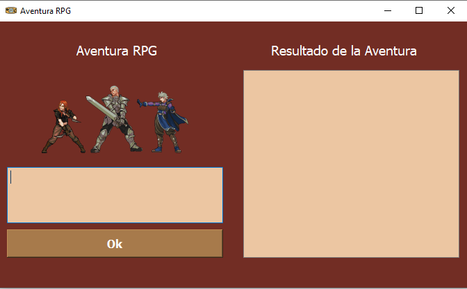
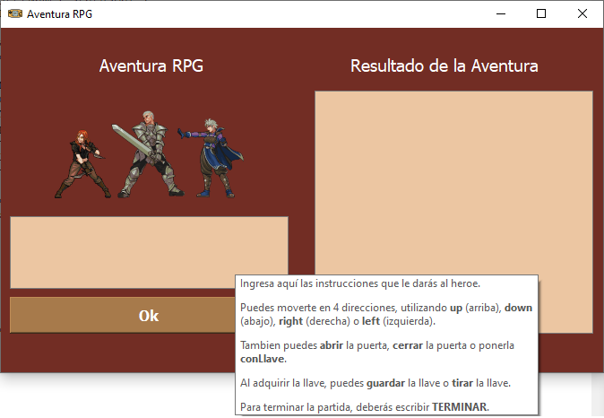
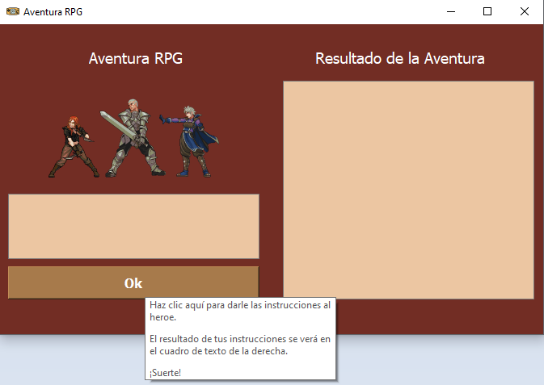
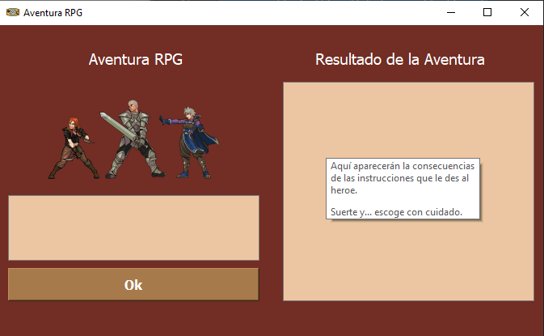

**************************************************
Juego RPG con Reglas Léxicas y Sintácticas en Ply
**************************************************
Este problema específico trata de un jugador dentro de una habitación con una puerta.
El jugador puede abrir, cerrar y cerrar con llave la puerta, si consigue la llave que se encuentra en la habitación.
Dentro de la habitación hay 2 llaves. El jugador también podrá tirar o guardar la llave, una vez la haya adquirido.

Código
=======
El código utilizado para la resolución de este problema fue el siguiente:

Imports utilizados
-------------------
Para realizar el proyecto, se utilizaron varios módulos.

Los módulos utilizados fueron:

.. code-block:: python

  import sys
  from PyQt5.QtWidgets import QApplication, QFileDialog, QMainWindow
  from PyQt5.QtCore import Qt

Dentro de layoutqt se encuentra el diseño de la gui utilizada, creada con QTPython

.. code-block:: python

  from layoutqt import Ui_MainWindow
  
Se utilizó Ply para la creación del lexer y el parser.
 
.. code-block:: python

  import ply.lex as lex
  import ply.yacc as yacc

Variables globales
-------------------
Para manejar variables que se utilizan en varios procesos, declaramos variables globales que se irán modificando a medida que se ejecuta el código.

.. code-block:: python

  i = 0
  j = 0
  doorStat = 0
  
Clase RpgApp
-------------
Creamos una clase llamada RpgApp, la cual tendrá como parámetro QMainWindow, lo que la enlazará con la interfaz gráfica creada.

.. code-block:: python

  class RpgApp(QMainWindow):
  
Función __init__
------------------
Dentro de esta función se inicia y conecta el botón que se utiliza para que se lea el input,
 como se mostrará a coninuación:
 
.. code-block:: python

  def __init__(self):
	super().__init__()
	self.ui = Ui_MainWindow()
	self.ui.setupUi(self)
	self.ui.okbtn.clicked.connect(self.rpg)
	self.show()
 
Tokens utilizados
-------------------
Los tokens utilizados en este programa fueron:

.. code-block:: python

  tokens = ['PUERTA', 'JUGADOR', 'LLAVE', 'NAME']
  
Reglas creadas
----------------
Las reglas que se utilizaron para cada token fueron:

.. code-block:: python

  #Reglas para las regex
        t_ignore = ' \t' #espacios y TABS
        
        #Funcion para la puerta
        def t_PUERTA(t):
           r'abrir|cerrar|conLlave'
           t.type = 'PUERTA'
           return t

		#Funcion para el movimiento del jugador   
        def t_JUGADOR(t):
           r'up|down|right|left'
           t.type = 'JUGADOR'
           return t
       
	    #Funcion para el estado de la llave
        def t_LLAVE(t):
           r'guardar|tirar'
           t.type = 'LLAVE'
           return t
        
		#Nombre del heroe
        def t_NAME(t):
           r'[a-zA-Z_][a-zA-Z_0-9]*'
           t.type = 'NAME'
           return t
       
        def t_error(t):
           print("Carácter Ilegal '%s'" % t.value)
           t.lexer.skip(1)

Las reglas anteriormente definidas nos indican los comandos que se pueden introducir dentro del juego, ya que son parte del lenguaje.

Lexer
------
El lexer escanea la entrada y produce los tokens correspondientes. 

A continuación, se presentará la construcción del lexer:
.. code-block:: python

   lex.lex()

Funciones de reglas
--------------------
A continuación se verán las funciones creadas para cada tipo de token.

Funcion de definicion de sintaxis
^^^^^^^^^^^^^^^^^^^^^^^^^^^^^^^^^^
.. code-block:: python

   def p_rpg(p):
	#Creación de reglas
	""" 
	todo : expression
		 | empty
	"""
	s=(str(run(p[1])))
	self.ui.outputtxt.setText(s)
	
Dentro de esta función, se define la sintaxis y se imprime en el editText llamado outputtxt la salida de la función run.

Funciones de valores de entrada
^^^^^^^^^^^^^^^^^^^^^^^^^^^^^^^^
.. code-block:: python

    #Para líneas vacías
	def p_empty(p):
	   """
	   empty :
	  """
	   p[0] = None
	  
	#para nombrar al heroe
	def p_expname(p):
	   '''expression : NAME
	   '''
	   try:
		  p[0] = p[1]
	   except LookupError:
		  print(f"Undefined name {p[1]!r}")
		  p[0] = 0
		  
	#Para el movimiento del heroe
	def p_moveplayer(p):
	  'expression : JUGADOR'
	  p[0] = p[1]

	#Para el estado de la llave
	def p_key(p):
	   'expression : LLAVE'
	   p[0] = p[1]
		
	#Para el estado de la puerta
	def p_doorstatur(p):
	   'expression : PUERTA'
	   p[0] = p[1]
   
	def p_error(p):
	   s=("Error de sintaxis!")
	   self.ui.outputtxt.setText(s)
	
Se puede apreciar que hay una función para cada regla creada anteriormente.

Parser
--------
El parser analiza los tokens y produce el resultado del análisis.

A continuación, se presentará la construcción del parser:
.. code-block:: python

  parser = yacc.yacc(debug=True)
  
Función principal
------------------
Se definirá la función run, encargada de revisar las entradas y realizar las operaciones necesarias en cada caso.

.. code-block:: python

  #Funcion principal
	def run(p):
		global aux

		#array de la ubicacion de la llave, el jugador empieza en pm[0][0]
		pm = [[0,0,1],
			  [1,0,0],
			  [0,0,0]]
		global i
		global j

		#variable auxiliar para saber el estado de la llave
		aux = pm[i][j]

		#Movimiento del heroe
		if p =='up':
			i -= 1
			aux = pm[i][j]
			if aux == 1:
				return("Has encontrado la llave! Intenta abrir la puerta")           
			else:
				return("La llave no esta aqui, intenta moverte en otra direccion.\nPuedes moverte hacia arriba (up), abajo (down), derecha (right) o izquierda (left).")

		if p == 'down':
			i += 1
			aux = pm[i][j]
			if aux == 1:
				return("Has encontrado la llave! Intenta abrir la puerta") 
				#return
			else:
				return("La llave no esta aqui, intenta moverte en otra direccion.\nPuedes moverte hacia arriba (up), abajo (down), derecha (right) o izquierda (left).")

		if p == 'right':
			j += 1
			aux = pm[i][j]
			if aux == 1:
				return("Has encontrado la llave! Intenta abrir la puerta")
				#return
			else:
				return("La llave no esta aqui, intenta moverte en otra direccion.\nPuedes moverte hacia arriba (up), abajo (down), derecha (right) o izquierda (left).")

		if p == 'left':
			j -= 1
			aux = pm[i][j]
			if aux == 1:
				return("Has encontrado la llave! Intenta abrir la puerta")
				#return
			else:
				return("La llave no esta aqui, intenta moverte en otra direccion.\nPuedes moverte hacia arriba (up), abajo (down), derecha (right) o izquierda (left).")

		#Estado de la puerta
		global doorStat
		if aux == 1:
			if p == 'abrir':
				if doorStat == 1:
					return("La puerta ya estaba abierta. Intenta cerrarla o ponerle llave.")
				else:
					doorStat = 1
					return("Has abierto la puerta. Ahora pueden entrar mounstros.")
			if p == 'cerrar':
				if doorStat == 1:
					doorStat = 0
					return("Has cerrado la puerta. Ya no pueden entrar mas mounstros.")
				else:
					return("La puerta ya estaba cerrada. Intenta abrirla o ponerle llave.")
			if p == 'conLlave':
				if doorStat != 2:
					doorStat = 2
					return("Has cerrado la puerta con llave. La puerta ahora se encuentra cerrada y con llave")
				else:
					return("La puerta ya estaba cerrada con llave. Intenta abrirla o cerrarla (sin llave).")
		if aux == 0: #Si aux esta en 0, el heroe no tiene la lave, por lo que no podrá realizar ninguna acción que requiera llave
			if p == 'abrir' or p == 'cerrar' or p == 'conLlave' or p == 'tirar' or p == 'guardar':
				return("Aun no tienes la llave! Intenta moverte hacia arriba (up), abajo (down), derecha (right) o izquierda (left).")

		#Tirar o guardar las llaves
		if aux == 1:
			if p == 'tirar':
				aux = 0 #Si decide tirar las llave, la variable aux cambiar'a a 0 para indicar que no tiene la llave
				return('Has tirado la llave. si quieres encontrarla de nuevo, tienes que moverte.\nPuedes moverte hacia arriba (up), abajo (down), derecha (right) o izquierda (left).')
				#return
			if p == 'guardar':
				return('Has guardado la llave en tu bolsillo. Puedes abrir, cerrar y cerrar con llave la puerta.')
				#return

Dentro de esta función se ejecutan todas las órdenes que envie el jugador y, dependiendo de las circunstancias, las consecuencias cambiarán.

Entrada por parte del usuario
------------------------------
El usuario escribirá dentro de un editText llamado inputtxt y, este input, se guardará dentro de una variable s, para ser enviado al parser.

Si el usuario escribe la palabra TERMINAR, saldrá un mensaje de despedida en el outputtxt.

.. code-block:: python

    s = self.ui.inputtxt.toPlainText()
	if (s.upper() == 'TERMINAR'):
		self.ui.outputtxt.setText("Programa terminado. Gracias por jugar!")
		return
		#parser.parse(s)  
	else:
		parser.parse(s)
		
Main
------
Para ejecutar la ventana del GUI, hay que iniciarla.

.. code-block:: python

  if __name__ == "__main__":
    app = QApplication(sys.argv)
    ventana = RpgApp()
    ventana.show()
    sys.exit(app.exec_())
	
Código de la interfaz gráfica
------------------------------
.. code-block:: python

  from PyQt5 import QtCore, QtGui, QtWidgets

  class Ui_MainWindow(object):
    def setupUi(self, MainWindow):
        MainWindow.setObjectName("MainWindow")
        MainWindow.resize(672, 384)
        palette = QtGui.QPalette()
        brush = QtGui.QBrush(QtGui.QColor(255, 255, 255))
        brush.setStyle(QtCore.Qt.SolidPattern)
        palette.setBrush(QtGui.QPalette.Active, QtGui.QPalette.WindowText, brush)
        brush = QtGui.QBrush(QtGui.QColor(114, 45, 36))
        brush.setStyle(QtCore.Qt.SolidPattern)
        palette.setBrush(QtGui.QPalette.Active, QtGui.QPalette.Button, brush)
        brush = QtGui.QBrush(QtGui.QColor(255, 255, 255))
        brush.setStyle(QtCore.Qt.SolidPattern)
        palette.setBrush(QtGui.QPalette.Active, QtGui.QPalette.ButtonText, brush)
        brush = QtGui.QBrush(QtGui.QColor(114, 45, 36))
        brush.setStyle(QtCore.Qt.SolidPattern)
        palette.setBrush(QtGui.QPalette.Active, QtGui.QPalette.Base, brush)
        brush = QtGui.QBrush(QtGui.QColor(114, 45, 36))
        brush.setStyle(QtCore.Qt.SolidPattern)
        palette.setBrush(QtGui.QPalette.Active, QtGui.QPalette.Window, brush)
        brush = QtGui.QBrush(QtGui.QColor(255, 255, 255))
        brush.setStyle(QtCore.Qt.SolidPattern)
        palette.setBrush(QtGui.QPalette.Inactive, QtGui.QPalette.WindowText, brush)
        brush = QtGui.QBrush(QtGui.QColor(114, 45, 36))
        brush.setStyle(QtCore.Qt.SolidPattern)
        palette.setBrush(QtGui.QPalette.Inactive, QtGui.QPalette.Button, brush)
        brush = QtGui.QBrush(QtGui.QColor(255, 255, 255))
        brush.setStyle(QtCore.Qt.SolidPattern)
        palette.setBrush(QtGui.QPalette.Inactive, QtGui.QPalette.ButtonText, brush)
        brush = QtGui.QBrush(QtGui.QColor(114, 45, 36))
        brush.setStyle(QtCore.Qt.SolidPattern)
        palette.setBrush(QtGui.QPalette.Inactive, QtGui.QPalette.Base, brush)
        brush = QtGui.QBrush(QtGui.QColor(114, 45, 36))
        brush.setStyle(QtCore.Qt.SolidPattern)
        palette.setBrush(QtGui.QPalette.Inactive, QtGui.QPalette.Window, brush)
        brush = QtGui.QBrush(QtGui.QColor(120, 120, 120))
        brush.setStyle(QtCore.Qt.SolidPattern)
        palette.setBrush(QtGui.QPalette.Disabled, QtGui.QPalette.WindowText, brush)
        brush = QtGui.QBrush(QtGui.QColor(114, 45, 36))
        brush.setStyle(QtCore.Qt.SolidPattern)
        palette.setBrush(QtGui.QPalette.Disabled, QtGui.QPalette.Button, brush)
        brush = QtGui.QBrush(QtGui.QColor(120, 120, 120))
        brush.setStyle(QtCore.Qt.SolidPattern)
        palette.setBrush(QtGui.QPalette.Disabled, QtGui.QPalette.ButtonText, brush)
        brush = QtGui.QBrush(QtGui.QColor(114, 45, 36))
        brush.setStyle(QtCore.Qt.SolidPattern)
        palette.setBrush(QtGui.QPalette.Disabled, QtGui.QPalette.Base, brush)
        brush = QtGui.QBrush(QtGui.QColor(114, 45, 36))
        brush.setStyle(QtCore.Qt.SolidPattern)
        palette.setBrush(QtGui.QPalette.Disabled, QtGui.QPalette.Window, brush)
        MainWindow.setPalette(palette)
        icon = QtGui.QIcon()
        icon.addPixmap(QtGui.QPixmap("C:/Users/Dani XD/Desktop/gameboy.png"), QtGui.QIcon.Normal, QtGui.QIcon.On)
        MainWindow.setWindowIcon(icon)
        MainWindow.setStyleSheet("\n"
		"background-color: rgb(114, 45, 36);")
        self.centralwidget = QtWidgets.QWidget(MainWindow)
        self.centralwidget.setObjectName("centralwidget")
        self.okbtn = QtWidgets.QPushButton(self.centralwidget)
        self.okbtn.setGeometry(QtCore.QRect(10, 300, 311, 41))
        palette = QtGui.QPalette()
        brush = QtGui.QBrush(QtGui.QColor(167, 122, 75))
        brush.setStyle(QtCore.Qt.SolidPattern)
        palette.setBrush(QtGui.QPalette.Active, QtGui.QPalette.Button, brush)
        brush = QtGui.QBrush(QtGui.QColor(255, 255, 255))
        brush.setStyle(QtCore.Qt.SolidPattern)
        palette.setBrush(QtGui.QPalette.Active, QtGui.QPalette.ButtonText, brush)
        brush = QtGui.QBrush(QtGui.QColor(167, 122, 75))
        brush.setStyle(QtCore.Qt.SolidPattern)
        palette.setBrush(QtGui.QPalette.Active, QtGui.QPalette.Base, brush)
        brush = QtGui.QBrush(QtGui.QColor(167, 122, 75))
        brush.setStyle(QtCore.Qt.SolidPattern)
        palette.setBrush(QtGui.QPalette.Active, QtGui.QPalette.Window, brush)
        brush = QtGui.QBrush(QtGui.QColor(167, 122, 75))
        brush.setStyle(QtCore.Qt.SolidPattern)
        palette.setBrush(QtGui.QPalette.Inactive, QtGui.QPalette.Button, brush)
        brush = QtGui.QBrush(QtGui.QColor(255, 255, 255))
        brush.setStyle(QtCore.Qt.SolidPattern)
        palette.setBrush(QtGui.QPalette.Inactive, QtGui.QPalette.ButtonText, brush)
        brush = QtGui.QBrush(QtGui.QColor(167, 122, 75))
        brush.setStyle(QtCore.Qt.SolidPattern)
        palette.setBrush(QtGui.QPalette.Inactive, QtGui.QPalette.Base, brush)
        brush = QtGui.QBrush(QtGui.QColor(167, 122, 75))
        brush.setStyle(QtCore.Qt.SolidPattern)
        palette.setBrush(QtGui.QPalette.Inactive, QtGui.QPalette.Window, brush)
        brush = QtGui.QBrush(QtGui.QColor(167, 122, 75))
        brush.setStyle(QtCore.Qt.SolidPattern)
        palette.setBrush(QtGui.QPalette.Disabled, QtGui.QPalette.Button, brush)
        brush = QtGui.QBrush(QtGui.QColor(120, 120, 120))
        brush.setStyle(QtCore.Qt.SolidPattern)
        palette.setBrush(QtGui.QPalette.Disabled, QtGui.QPalette.ButtonText, brush)
        brush = QtGui.QBrush(QtGui.QColor(167, 122, 75))
        brush.setStyle(QtCore.Qt.SolidPattern)
        palette.setBrush(QtGui.QPalette.Disabled, QtGui.QPalette.Base, brush)
        brush = QtGui.QBrush(QtGui.QColor(167, 122, 75))
        brush.setStyle(QtCore.Qt.SolidPattern)
        palette.setBrush(QtGui.QPalette.Disabled, QtGui.QPalette.Window, brush)
        self.okbtn.setPalette(palette)
        font = QtGui.QFont()
        font.setPointSize(12)
        font.setBold(True)
        font.setWeight(75)
        self.okbtn.setFont(font)
        self.okbtn.setStyleSheet("background-color: rgb(167, 122, 75);")
        self.okbtn.setObjectName("okbtn")
        self.inputtxt = QtWidgets.QTextEdit(self.centralwidget)
        self.inputtxt.setGeometry(QtCore.QRect(10, 210, 311, 81))
        font = QtGui.QFont()
        font.setPointSize(12)
        self.inputtxt.setFont(font)
        self.inputtxt.setStyleSheet("background-color: rgb(236, 198, 162);")
        self.inputtxt.setObjectName("inputtxt")
        self.label = QtWidgets.QLabel(self.centralwidget)
        self.label.setGeometry(QtCore.QRect(110, 30, 116, 23))
        palette = QtGui.QPalette()
        brush = QtGui.QBrush(QtGui.QColor(255, 255, 255))
        brush.setStyle(QtCore.Qt.SolidPattern)
        palette.setBrush(QtGui.QPalette.Active, QtGui.QPalette.WindowText, brush)
        brush = QtGui.QBrush(QtGui.QColor(114, 45, 36))
        brush.setStyle(QtCore.Qt.SolidPattern)
        palette.setBrush(QtGui.QPalette.Active, QtGui.QPalette.Button, brush)
        brush = QtGui.QBrush(QtGui.QColor(114, 45, 36))
        brush.setStyle(QtCore.Qt.SolidPattern)
        palette.setBrush(QtGui.QPalette.Active, QtGui.QPalette.Base, brush)
        brush = QtGui.QBrush(QtGui.QColor(114, 45, 36))
        brush.setStyle(QtCore.Qt.SolidPattern)
        palette.setBrush(QtGui.QPalette.Active, QtGui.QPalette.Window, brush)
        brush = QtGui.QBrush(QtGui.QColor(255, 255, 255))
        brush.setStyle(QtCore.Qt.SolidPattern)
        palette.setBrush(QtGui.QPalette.Inactive, QtGui.QPalette.WindowText, brush)
        brush = QtGui.QBrush(QtGui.QColor(114, 45, 36))
        brush.setStyle(QtCore.Qt.SolidPattern)
        palette.setBrush(QtGui.QPalette.Inactive, QtGui.QPalette.Button, brush)
        brush = QtGui.QBrush(QtGui.QColor(114, 45, 36))
        brush.setStyle(QtCore.Qt.SolidPattern)
        palette.setBrush(QtGui.QPalette.Inactive, QtGui.QPalette.Base, brush)
        brush = QtGui.QBrush(QtGui.QColor(114, 45, 36))
        brush.setStyle(QtCore.Qt.SolidPattern)
        palette.setBrush(QtGui.QPalette.Inactive, QtGui.QPalette.Window, brush)
        brush = QtGui.QBrush(QtGui.QColor(120, 120, 120))
        brush.setStyle(QtCore.Qt.SolidPattern)
        palette.setBrush(QtGui.QPalette.Disabled, QtGui.QPalette.WindowText, brush)
        brush = QtGui.QBrush(QtGui.QColor(114, 45, 36))
        brush.setStyle(QtCore.Qt.SolidPattern)
        palette.setBrush(QtGui.QPalette.Disabled, QtGui.QPalette.Button, brush)
        brush = QtGui.QBrush(QtGui.QColor(114, 45, 36))
        brush.setStyle(QtCore.Qt.SolidPattern)
        palette.setBrush(QtGui.QPalette.Disabled, QtGui.QPalette.Base, brush)
        brush = QtGui.QBrush(QtGui.QColor(114, 45, 36))
        brush.setStyle(QtCore.Qt.SolidPattern)
        palette.setBrush(QtGui.QPalette.Disabled, QtGui.QPalette.Window, brush)
        self.label.setPalette(palette)
        self.label.setStyleSheet("font: 75 14pt \"MS Shell Dlg 2\";")
        self.label.setObjectName("label")
        self.label_2 = QtWidgets.QLabel(self.centralwidget)
        self.label_2.setGeometry(QtCore.QRect(390, 30, 210, 23))
        palette = QtGui.QPalette()
        brush = QtGui.QBrush(QtGui.QColor(255, 255, 255))
        brush.setStyle(QtCore.Qt.SolidPattern)
        palette.setBrush(QtGui.QPalette.Active, QtGui.QPalette.WindowText, brush)
        brush = QtGui.QBrush(QtGui.QColor(114, 45, 36))
        brush.setStyle(QtCore.Qt.SolidPattern)
        palette.setBrush(QtGui.QPalette.Active, QtGui.QPalette.Button, brush)
        brush = QtGui.QBrush(QtGui.QColor(114, 45, 36))
        brush.setStyle(QtCore.Qt.SolidPattern)
        palette.setBrush(QtGui.QPalette.Active, QtGui.QPalette.Base, brush)
        brush = QtGui.QBrush(QtGui.QColor(114, 45, 36))
        brush.setStyle(QtCore.Qt.SolidPattern)
        palette.setBrush(QtGui.QPalette.Active, QtGui.QPalette.Window, brush)
        brush = QtGui.QBrush(QtGui.QColor(255, 255, 255))
        brush.setStyle(QtCore.Qt.SolidPattern)
        palette.setBrush(QtGui.QPalette.Inactive, QtGui.QPalette.WindowText, brush)
        brush = QtGui.QBrush(QtGui.QColor(114, 45, 36))
        brush.setStyle(QtCore.Qt.SolidPattern)
        palette.setBrush(QtGui.QPalette.Inactive, QtGui.QPalette.Button, brush)
        brush = QtGui.QBrush(QtGui.QColor(114, 45, 36))
        brush.setStyle(QtCore.Qt.SolidPattern)
        palette.setBrush(QtGui.QPalette.Inactive, QtGui.QPalette.Base, brush)
        brush = QtGui.QBrush(QtGui.QColor(114, 45, 36))
        brush.setStyle(QtCore.Qt.SolidPattern)
        palette.setBrush(QtGui.QPalette.Inactive, QtGui.QPalette.Window, brush)
        brush = QtGui.QBrush(QtGui.QColor(120, 120, 120))
        brush.setStyle(QtCore.Qt.SolidPattern)
        palette.setBrush(QtGui.QPalette.Disabled, QtGui.QPalette.WindowText, brush)
        brush = QtGui.QBrush(QtGui.QColor(114, 45, 36))
        brush.setStyle(QtCore.Qt.SolidPattern)
        palette.setBrush(QtGui.QPalette.Disabled, QtGui.QPalette.Button, brush)
        brush = QtGui.QBrush(QtGui.QColor(114, 45, 36))
        brush.setStyle(QtCore.Qt.SolidPattern)
        palette.setBrush(QtGui.QPalette.Disabled, QtGui.QPalette.Base, brush)
        brush = QtGui.QBrush(QtGui.QColor(114, 45, 36))
        brush.setStyle(QtCore.Qt.SolidPattern)
        palette.setBrush(QtGui.QPalette.Disabled, QtGui.QPalette.Window, brush)
        self.label_2.setPalette(palette)
        self.label_2.setStyleSheet("font: 75 14pt \"MS Shell Dlg 2\";")
        self.label_2.setObjectName("label_2")
        self.outputtxt = QtWidgets.QTextEdit(self.centralwidget)
        self.outputtxt.setGeometry(QtCore.QRect(350, 70, 311, 271))
        font = QtGui.QFont()
        font.setPointSize(12)
        self.outputtxt.setFont(font)
        self.outputtxt.setStyleSheet("background-color: rgb(236, 198, 162);")
        self.outputtxt.setObjectName("outputtxt")
        self.label_3 = QtWidgets.QLabel(self.centralwidget)
        self.label_3.setGeometry(QtCore.QRect(60, 90, 225, 100))
        self.label_3.setObjectName("label_3")
        MainWindow.setCentralWidget(self.centralwidget)
        self.menubar = QtWidgets.QMenuBar(MainWindow)
        self.menubar.setGeometry(QtCore.QRect(0, 0, 672, 21))
        self.menubar.setObjectName("menubar")
        MainWindow.setMenuBar(self.menubar)
        self.statusbar = QtWidgets.QStatusBar(MainWindow)
        self.statusbar.setObjectName("statusbar")
        MainWindow.setStatusBar(self.statusbar)

        self.retranslateUi(MainWindow)
        QtCore.QMetaObject.connectSlotsByName(MainWindow)

    def retranslateUi(self, MainWindow):
        _translate = QtCore.QCoreApplication.translate
        MainWindow.setWindowTitle(_translate("MainWindow", "Aventura RPG"))
        self.okbtn.setToolTip(_translate("MainWindow", "<html><head/><body>
Haz clic aquí para darle las instrucciones al heroe.

El resultado de tus instrucciones se verá en el cuadro de texto de la derecha.

¡Suerte!
</body></html>"))
        self.okbtn.setText(_translate("MainWindow", "Ok"))
        self.inputtxt.setToolTip(_translate("MainWindow", "<html><head/><body>
Ingresa aquí las instrucciones que le darás al heroe.

Puedes moverte en 4 direcciones, utilizando up (arriba), down (abajo), right (derecha) o left (izquierda).

Tambien puedes abrir la puerta, cerrar la puerta o ponerla conLlave.

Al adquirir la llave, puedes guardar la llave o tirar la llave.

Para terminar la partida, deberás escribir TERMINAR.
</body></html>"))
        self.label.setText(_translate("MainWindow", "Aventura RPG"))
        self.label_2.setText(_translate("MainWindow", "Resultado de la Aventura"))
        self.outputtxt.setToolTip(_translate("MainWindow", "<html><head/><body>
Aquí aparecerán la consecuencias de las instrucciones que le des al heroe.

Suerte y... escoge con cuidado.
</body></html>"))
        self.label_3.setWhatsThis(_translate("MainWindow", "<html><head/><body>

</body></html>"))
        self.label_3.setText(_translate("MainWindow", "<html><head/><body>

</body></html>"))
  #import rcs2_rc
  #import rsc_rc

  if __name__ == "__main__":
      import sys
      app = QtWidgets.QApplication(sys.argv)
      MainWindow = QtWidgets.QMainWindow()
      ui = Ui_MainWindow()
      ui.setupUi(MainWindow)
      MainWindow.show()
      sys.exit(app.exec_())

Imagen de la interfaz gráfica
==============================
Interfaz

Tooltips incorporados

